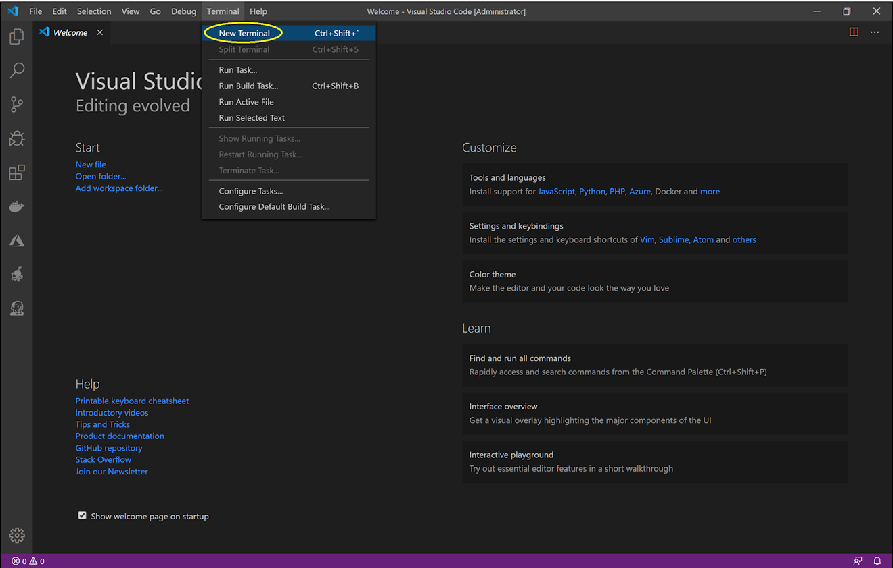

# Example - Project API .Net Core

## Create a new project 

**1.** 
	Launch Visual Code and open a Terminal {: .gitlab-purple} 

	Ouvrez le Visual Code et allez dans l'option "Terminal" {: .gitlab-orange}

	Abra o Visual Code e vá na opção "Terminal"
	


**2.** 	Go to folder of your project

	Allez sur le dossier de votre projet

	Abra a pasta do seu projeto


**3.** 	Run the command

	Éxecutez la command ci-dessous

	Execute o comando 

```
dotnet new webapi -o "nameofproject"
```

> nameofproject 

	Enter the name of your project 

	Informez le nom de votre projet 

	Indique o nome do seu projeto


**4.** 	Open your project with Visual Code
	
	Ouvrez votre projet avec Visual Code
	
	Abra o projeto com o Visual Code


**5.** 	Run your project for the first time
	
	Éxecutez votre projet pour la première fois
	
```
dotnet run
```


**6.** 	Open Postman application or other platform for API Development
	Ouvrez l'application Postman ou une autre application pour tester votre API.
	Abrir o Postman ou uma outra aplicação para testar a API.
	
```
https://localhost:5001/WeatherForecast
```

> Postman Download: https://www.postman.com/


## Create your API

> This example is based on https://docs.microsoft.com/en-us/aspnet/core/tutorials/first-web-api?view=aspnetcore-3.1&tabs=visual-studio-code

**1.** 	Create a new folder "Models" and a new file "BDContext.cs"

		Créer un nouveau dossier "Models" et un nouveau fichier "BDContext.cs"

		Crie uma nova pasta "Models" e um novo arquivo "BDContext.cs"
		


**2.** 	Enter the code

		Ajouter le code ci-dessous

		Adicione o código abaixo
		
```	
namespace apidotnetcore.Models
{
    public class BDContext : DbContext
    {
        public BDContext(DbContextOptions<BDContext> options)
           : base(options)
        {}
    }
}
```

**3.** 	Install the package and add a reference

		Installez la librarie et ajouter la reference dans le fichier

		Instale o pacote e adicione a referência no arquivo
	
> Microsoft.EntityFrameworkCore - https://www.nuget.org/packages/Microsoft.EntityFrameworkCore/

```	
dotnet add package Microsoft.EntityFrameworkCore --version 3.1.6
```	


**4.**	Add your models in the folder "Models" and put a reference in the file BDContext.

		Ajoutez vos models dans le dossier "Models" et les references dans le fichier BDContext.
		
		Coloque seus modelos dentro da pasta "Models" e acrescente a referência no arquivo BDContext.

 > Example: 
```	
public DbSet<NameModel> name_of_table { get; set; }
public DbSet<NomduModel> nom_de_la_table { get; set; }
public DbSet<NomedoModel> nome_da_tabela { get; set; }
```	
**5.** 	Open your file Startup.cs and add your database connection.

		Ouvrez le fichier Startup.cs et ajouter votre connexion de la base de données.
		
		Abra o seu arquivo Startup.cs et adicione a sua conexão com o banco de dados.
		
> Example SQlite - https://www.nuget.org/packages/Microsoft.EntityFrameworkCore.Sqlite/

```	
public void ConfigureServices(IServiceCollection services)
{
var connection = @"Data Source=C:\projects\bd\bdproject.db";
services.AddDbContext<BDContext>(options => options.UseSqlite(connection));
services.AddControllers();
services.AddCors();
}
```	
>  Example PostgreSQL - https://www.nuget.org/packages/Npgsql.EntityFrameworkCore.PostgreSQL

```	
public void ConfigureServices(IServiceCollection services)
{
var connection = @"Host=127.0.0.1;Port=7000;Database=nameofdb;User Id=*****;Password=*****";
services.AddDbContext<BDContext>(options => options.UseNpgsql(connection));
services.AddControllers();
services.AddCors();
}
```	

**6.** 	Add Authentication with your API's

		Ajouter l'authentication dans vos API's

		Adicione a autenticação nas suas API's

```	

services.AddAuthentication(options =>
{
	options.DefaultAuthenticateScheme = JwtBearerDefaults.AuthenticationScheme;
    options.DefaultChallengeScheme = JwtBearerDefaults.AuthenticationScheme;
    }).AddJwtBearer(o =>
    {
		o.Authority = "https://address/auth/realms/namerealm";
        o.Audience = "nameclient";
        o.Events = new JwtBearerEvents()
        {
			OnAuthenticationFailed = c =>
            {
				c.NoResult();
				c.Response.StatusCode = 500;
                c.Response.ContentType = "text/plain";

                return c.Response.WriteAsync(c.Exception.ToString() + "An error occured processing your authentication.");
            }
        };
    });
}
		 
public void Configure(IApplicationBuilder app, IWebHostEnvironment env)
{
	if (env.IsDevelopment())
    {
		app.UseDeveloperExceptionPage();
    }

    app.UseHttpsRedirection();

    app.UseRouting();
    app.UseAuthentication();
    app.UseAuthorization();

    app.UseCors(builder =>
    {
		builder.AllowAnyOrigin()
               .AllowAnyHeader()
               .AllowAnyMethod();
    });

    app.UseEndpoints(endpoints =>
    {
		endpoints.MapControllers();
    });
}
```	