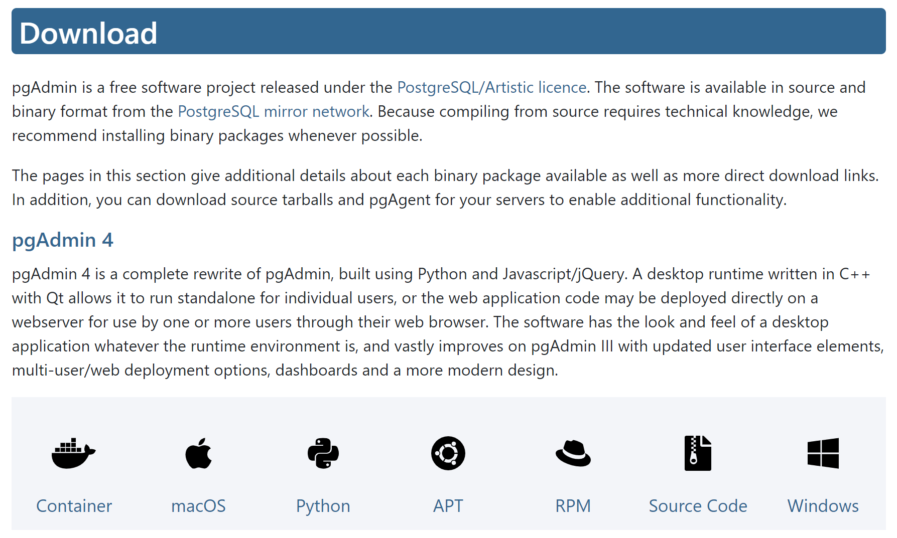
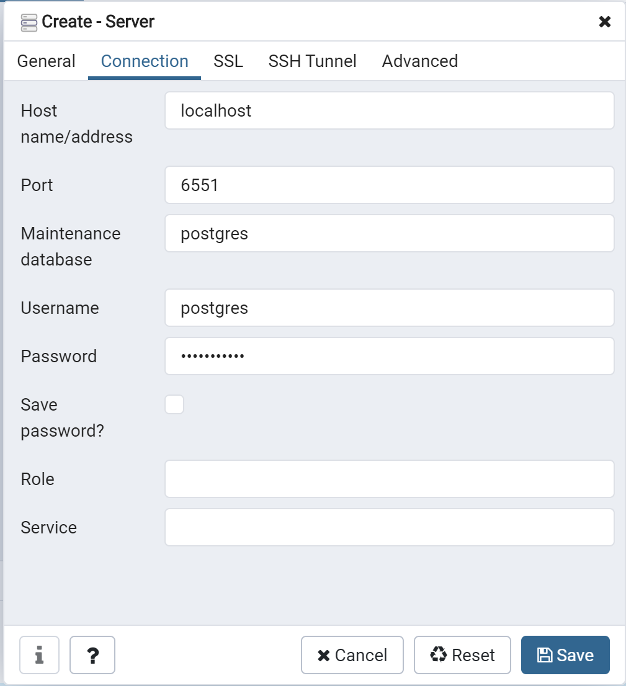

# Example - Create container Postgres with Docker Windows

> Docker Windows Download: https://www.docker.com/products/docker-desktop
---
```diff
# Your Docker Windows must be in "running" status.
! Votre Docker Windows doit être avec le statut "en cours".
+ O Docker Windows deve estar com o status "executando".
```
---

> Postgres PgAdmin4 Download: https://www.pgadmin.org/download/



## Image Docker

> Official Image - https://hub.docker.com/_/postgres

```
docker pull postgres
```

```
docker run --name examplepostgresdb -p 6551:5432 -e POSTGRES_PASSWORD=password123 -d postgres
```

## Configuration Postgres - pgadmin4

```diff
# Open you pgadmin4 and configure a new "Server".
! Ouvrez le pgadmin4 et configurez un nouveau "Serveur".
+ Abra o pgadmin4 e configure um novo "Servidor".
```



```diff
# Open you pgadmin4 and configure a new "Server".
! Ouvrez le pgadmin4 et configurez un nouveau "Serveur".
+ Abra o pgadmin4 e configure um novo "Servidor".
```

## Validate container postgres on docker-desktop

```diff
# List of containers.
! Liste de containeurs.
+ Lista dos containers.
```

```
docker ps
```

```diff
# Start your container.
! Initialiser votre containeur.
+ Inicializa o seu container.
```

```
docker start examplepostgresdb
```

```diff
# Stop your container.
! Arreter votre containeur.
+ Parar o seu container.
```

```
docker stop examplepostgresdb
```

```diff
# Remove your container.
! Enlever votre containeur.
+ Apagar o seu container.
```

```
docker rm examplepostgresdb
```

